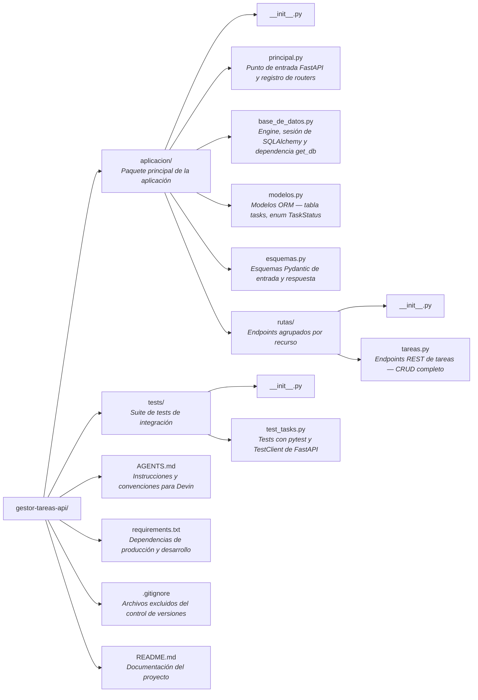

# API de Gestión de Tareas

API REST para gestionar el ciclo de vida de tareas, construida con **FastAPI** y **SQLAlchemy**.
Permite crear, consultar, actualizar parcialmente y eliminar tareas. Cada tarea posee un
identificador único, título, descripción opcional, estado (`pending`, `in_progress`, `done`) y
fecha de creación asignada automáticamente.

---

## Requisitos previos

| Requisito | Versión mínima |
|-----------|---------------|
| Python | 3.12+ |
| pip | 23+ (incluido con Python) |

### Dependencias de producción

| Paquete | Versión |
|---------|---------|
| FastAPI | 0.136.1 |
| SQLAlchemy | 2.0.49 |
| Pydantic | 2.13.4 |
| Uvicorn | 0.46.0 |

### Dependencias de desarrollo y tests

| Paquete | Versión |
|---------|---------|
| pytest | 9.0.3 |
| httpx | 0.28.1 |
| anyio | 4.13.0 |

---

## Instalación

1. **Clonar el repositorio:**

   ```bash
   git clone https://github.com/ignaciomg1978/gestor-tareas-api.git
   cd gestor-tareas-api
   ```

2. **Crear y activar un entorno virtual:**

   ```bash
   python -m venv venv
   # macOS / Linux
   source venv/bin/activate
   # Windows
   venv\Scripts\activate
   ```

3. **Instalar las dependencias:**

   ```bash
   pip install -r requirements.txt
   ```

---

## Cómo arrancar la aplicación

```bash
uvicorn aplicacion.principal:app --reload
```

La API quedará disponible en `http://127.0.0.1:8000`.

La documentación interactiva (Swagger UI) se genera automáticamente en
`http://127.0.0.1:8000/docs`.

---

## Endpoints

La API expone cinco endpoints bajo el prefijo `/tasks`.

### 1. Listar todas las tareas

| | |
|---|---|
| **Método** | `GET` |
| **Ruta** | `/tasks/` |
| **Parámetros** | Ninguno |

**Ejemplo curl:**

```bash
curl -X GET http://127.0.0.1:8000/tasks/
```

**Ejemplo de respuesta** (`200 OK`):

```json
[
  {
    "id": 1,
    "title": "Revisar documentación",
    "description": "Revisar la documentación del sprint 3",
    "status": "pending",
    "created_at": "2025-05-20T10:30:00"
  },
  {
    "id": 2,
    "title": "Corregir bug login",
    "description": null,
    "status": "in_progress",
    "created_at": "2025-05-20T11:00:00"
  }
]
```

---

### 2. Obtener una tarea por id

| | |
|---|---|
| **Método** | `GET` |
| **Ruta** | `/tasks/{task_id}` |
| **Parámetros de ruta** | `task_id` (int) — Identificador de la tarea |

**Ejemplo curl:**

```bash
curl -X GET http://127.0.0.1:8000/tasks/1
```

**Ejemplo de respuesta** (`200 OK`):

```json
{
  "id": 1,
  "title": "Revisar documentación",
  "description": "Revisar la documentación del sprint 3",
  "status": "pending",
  "created_at": "2025-05-20T10:30:00"
}
```

**Respuesta de error** (`404 Not Found`):

```json
{
  "detail": "Task not found"
}
```

---

### 3. Crear una nueva tarea

| | |
|---|---|
| **Método** | `POST` |
| **Ruta** | `/tasks/` |
| **Cuerpo (JSON)** | `title` (str, obligatorio), `description` (str, opcional, máx 200 caracteres), `status` (str, opcional — por defecto `"pending"`) |

Valores válidos para `status`: `"pending"`, `"in_progress"`, `"done"`.

**Ejemplo curl:**

```bash
curl -X POST http://127.0.0.1:8000/tasks/ \
  -H "Content-Type: application/json" \
  -d '{"title": "Diseñar API", "description": "Definir contratos de endpoints"}'
```

**Ejemplo de respuesta** (`201 Created`):

```json
{
  "id": 3,
  "title": "Diseñar API",
  "description": "Definir contratos de endpoints",
  "status": "pending",
  "created_at": "2025-05-20T12:00:00"
}
```

---

### 4. Actualizar parcialmente una tarea

| | |
|---|---|
| **Método** | `PATCH` |
| **Ruta** | `/tasks/{task_id}` |
| **Parámetros de ruta** | `task_id` (int) — Identificador de la tarea |
| **Cuerpo (JSON)** | `title` (str, opcional), `description` (str, opcional, máx 200 caracteres), `status` (str, opcional) |

> **Restricción:** no se permite actualizar una tarea cuyo estado sea `done`.

**Ejemplo curl:**

```bash
curl -X PATCH http://127.0.0.1:8000/tasks/1 \
  -H "Content-Type: application/json" \
  -d '{"status": "in_progress"}'
```

**Ejemplo de respuesta** (`200 OK`):

```json
{
  "id": 1,
  "title": "Revisar documentación",
  "description": "Revisar la documentación del sprint 3",
  "status": "in_progress",
  "created_at": "2025-05-20T10:30:00"
}
```

**Respuesta de error — tarea no encontrada** (`404 Not Found`):

```json
{
  "detail": "Task not found"
}
```

**Respuesta de error — tarea completada** (`400 Bad Request`):

```json
{
  "detail": "Cannot update a completed task"
}
```

---

### 5. Eliminar una tarea

| | |
|---|---|
| **Método** | `DELETE` |
| **Ruta** | `/tasks/{task_id}` |
| **Parámetros de ruta** | `task_id` (int) — Identificador de la tarea |

**Ejemplo curl:**

```bash
curl -X DELETE http://127.0.0.1:8000/tasks/1
```

**Respuesta exitosa:** `204 No Content` (sin cuerpo).

**Respuesta de error** (`404 Not Found`):

```json
{
  "detail": "Task not found"
}
```

---

## Cómo ejecutar los tests

```bash
pytest tests/ -v
```

Los tests utilizan una base de datos SQLite independiente para garantizar el aislamiento
entre casos de prueba. No afectan al archivo `tareas.db` de producción.

---

## Estructura del proyecto



| Ruta | Descripción |
|------|-------------|
| `aplicacion/principal.py` | Punto de entrada: crea la instancia de FastAPI y registra los routers |
| `aplicacion/base_de_datos.py` | Configuración del engine y la sesión de SQLAlchemy; expone la dependencia `get_db` |
| `aplicacion/modelos.py` | Modelos ORM: tabla `tasks` y enumeración `TaskStatus` |
| `aplicacion/esquemas.py` | Esquemas Pydantic: `TaskCreate`, `TaskUpdate` (entrada) y `TaskResponse` (salida) |
| `aplicacion/rutas/tareas.py` | Definición de los cinco endpoints REST (CRUD completo de tareas) |
| `tests/test_tasks.py` | Tests de integración con pytest, httpx y SQLite independiente |
| `requirements.txt` | Dependencias fijadas de producción y desarrollo |
